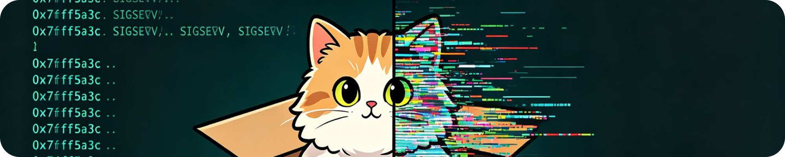
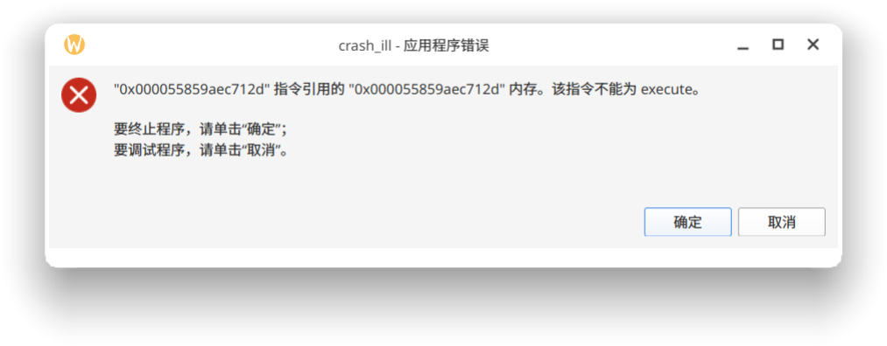

<!-- markdownlint-disable MD033 MD036 MD041 -->

<div align="center">



# 🤔 libschrodinger 🥵

**我修复了 Linux 没有「应用程序错误」窗口的 Bug**

</div>

> [!WARNING]
> **该项目仅供以测试和娱乐为目的的使用。**

---

## 📖 About

`libschrodinger` 是 Linux 上的一个 `LD_PRELOAD` 整活项目。

`libschrodinger` 在程序触发部分致命信号（如 `SIGSEGV`、`SIGBUS`、`SIGILL`、`SIGFPE`、`SIGABRT` 等）时拦截，弹出一个 Microsoft Windows 风格的错误对话框，以还原该 **现代商业操作系统** 自 Windows XP 流传下来的神秘提示。普通 errno 报错、正常退出、`SIGINT`、`SIGTERM` 等不受影响。

## ✨ Features

弹出的对话框上复刻了 Windows 的两个按钮。其中「**确定**」将恢复之前的信号处置流程并重新投递原信号，程序按照正常路径终止；「**取消**」将关闭对话框，随后在终端（优先 `kitty`、回退 `konsole`）中启动 `pwndbg -p <pid>`（回退 `gdb`）附加到仍然冻结在信号处理上下文中的进程。关闭调试器后，程序按照原信号终止。

当前版本的 `libschrodinger` 支持下面的信号：

| 信号 | 提示文本 |
| --- | --- |
| `SIGSEGV`（读访问） | `"<ip>" 指令引用的 "<addr>" 内存。该内存不能为 read。` |
| `SIGSEGV`（写访问） | 同上，但为 `written` |
| `SIGBUS`（`BUS_ADRALN`） | 同上，但为 `aligned` |
| `SIGBUS`（其他） | 同上，但为 `read` |
| `SIGILL` | `"<ip>" 指令引用的 "<addr>" 内存。该指令不能为 execute。` |
| `SIGFPE`（整数除零等） | `"<ip>" 处发生整数除法。该除数不能为 zero。` 等，按 `si_code` 细分 |
| `SIGABRT` | MSVCRT 风格：`Runtime Error!` 一段，仅一个 `确定` 按钮 |

`SIGFPE` 与 `SIGABRT` 不会显示内存故障地址，仅显示发生的运算类型。

`read` / `written` 不由 `si_code` 判断，而由 x86-64 页故障错误码的写位判定：读 `PROT_NONE` 页时是 `SEGV_ACCERR`，写未映射页时是 `SEGV_MAPERR`。

## 👀 Preview



## 🚀 Build

构建时需要 Qt6 Widgets 开发环境、GCC 和 G++、Make。对于 Nix 用户，可以 `git clone` 该 repo 后使用 `nix develop` 准备开发环境：

```sh
gh repo clone LyCecilion/libschrodinger
cd libschrodinger
nix develop
make
```

对于其他用户，参阅对应发行版的包管理器以安装全部依赖。`make` 后会获得 2 个编译产物：

```text
./build/libschrodinger.so    # ELF 共享对象（LD_PRELOAD 库）
./build/schrodinger-dialog   # Qt6 崩溃对话框辅助程序
```

可用 `file` 确认类型：

```sh
file ./build/libschrodinger.so ./build/schrodinger-dialog
```

`make clean` 仅删除 `build/`。Makefile 默认通过 `pkg-config` 消费 Nix 提供的 Qt6 元数据；等价的主机 Qt6（如 Fedora 的 `qt6-qtbase-devel`）也可作为 Nix 之外的回退，不改变运行时行为。

## 📝 Usage

对一次命令注入（不会修改当前 shell 的后续命令）：

```sh
LD_PRELOAD="$PWD/build/libschrodinger.so" <program>
```

下面给出一些可复现的崩溃示例：

```sh
# SIGABRT
LD_PRELOAD="$PWD/build/libschrodinger.so" python3 -c 'import os; os.abort()'
# SIGSEGV
LD_PRELOAD="$PWD/build/libschrodinger.so" python3 -c 'import ctypes; ctypes.string_at(0)'
```

在崩溃发生后会弹出对话框。点击「**确定**」将会使程序继续以错误终止；点击「**取消**」则会先关闭对话框，再经由终端模拟器打开调试器，你可以在这里检查仍存活的进程与栈。退出调试器后程序终止。

另一种方式是，在 `tests/` 下用独立的 C 崩溃程序逐个触发（`cd tests && make`）。例如测试 SIGSEGV 写：

```sh
LD_PRELOAD="$PWD/../build/libschrodinger.so" ./crash_segv_write
```

值得注意的是，在 Nix dev shell 里编译 `tests/` 时，Nix 的 gcc wrapper 会默认注入 `-D_FORTIFY_SOURCE`，而测试程序刻意用 `-O0`（保证崩溃点不被优化掉），于是会触发一条无害的 `#warning _FORTIFY_SOURCE requires -O`。该 warning 可忽略，不影响测试程序的行为。

## ❓ FAQ

类似于前作 [libobscure](https://github.com/LyCecilion/libobscure)，该项目同样仅支持 Linux、不支持静态链接程序、不注入 setuid/setcap 程序。

`libschrodinger` 默认你具有 X11/Wayland 图形环境、Kitty 和 Konsole 中至少其一、pwndbg 和 gdb 中至少其一。`libschrodinger` 的触发是尽力而为的，在子进程失败、调试器无法打开、终端模拟器不可用等任何情况下，`libschrodinger` 都会回退以恢复默认信号处置并重新投递原信号，不吞掉原程序的崩溃。

`libschrodinger` 的错误处理逻辑可能会被目标程序内自带的错误处理逻辑替换。

## 🤔 原理

>[!NOTE]
> 本节由 DeepSeek V4 Pro 0813 编写和校对。
<!-- -->
> **TL;DR:<br/>`LD_PRELOAD` 让动态链接器在程序启动前先加载本库，库的构造函数给五个致命信号装上处理器。崩溃时处理器不直接弹窗（信号处理器里不能碰 Qt、malloc 这类东西），而是 fork 一个干净子进程去 exec Qt 辅助程序；父进程等用户点按钮，再按选择恢复原信号终止，或先拉起 gdb 再终止。**

下面按「谁加载、何时装、崩溃时干什么、为什么这样设计」的顺序展开。

### 1. 谁加载、何时装

Linux 的动态链接 ELF 程序启动时，动态链接器会先加载 `LD_PRELOAD` 指定的共享对象，再加载程序的普通依赖。`libschrodinger.so` 一被加载，它的 `__attribute__((constructor))` 构造函数 `schrodinger_init()` 就立刻执行——此时程序还没进 `main()`，崩溃也还没发生。

构造函数在这个「安全、单线程、能随意 malloc」的时机，把所有能在崩溃前做掉的事提前做完：

- 用 `dladdr()` 拿到库自身的绝对路径，推出同目录下 `schrodinger-dialog` 辅助程序的路径（运行时不依赖当前工作目录）；
- 从 `/proc/self/exe` 读出可执行文件 basename，作为对话框标题里的程序名；
- 在 `PATH` 里解析出 `kitty`、`konsole`、`pwndbg`、`gdb` 的绝对路径；
- 预计算一份去掉 `LD_PRELOAD` 的环境快照；
- 用 `sigaltstack` 注册一块 16 KiB 备用信号栈；
- 用 `sigaction(..., SA_SIGINFO | SA_ONSTACK)` 给 `SIGSEGV`/`SIGBUS`/`SIGILL`/`SIGFPE`/`SIGABRT` 装上同一个处理器，并缓存这五个信号的原始处置，以便稍后恢复。

「提前做完」是关键：崩溃那一刻的处理器只能做极小一撮操作（见下），所以越多的活提前干完，崩溃路径就越短、越不容易出错。

### 2. 崩溃时内核做了什么

程序触发 `SIGSEGV` 这类致命信号时，内核默认会立刻杀掉进程。但我们把默认处置换成了自己的处理器，于是内核改而调用 `crash_handler()`，并塞给它两样东西：

- `siginfo_t`：`si_addr`（故障地址）、`si_code`（故障子类型，如 `SEGV_MAPERR`/`SEGV_ACCERR`）等；
- `ucontext_t`：寄存器现场，能取出 `RIP`（指令指针）和 `REG_ERR`（页故障错误码）。

处理器运行在一个极其受限的环境里，术语叫「异步信号安全」（async-signal-safe）：信号可能落在程序执行到**任意一行**的那一刻，比如某个线程正握着 `malloc` 的内部锁。此时处理器若再调 `malloc`/`printf`/`setenv`，就可能去抢一把永远拿不到的锁，整个进程卡死。所以处理器只允许 `fork`/`exec`/`wait`/`write`/`kill`/`sigaction` 这一族 syscall，连格式化地址都是自己写的纯算术固定缓冲实现，不碰 libc 的分配器。

### 3. 为什么 fork 一个子进程去弹窗

弹 Qt 窗口要初始化 `QApplication`、分配内存、连显示服务器——全是处理器里不能做的事。解法是 `fork()`：子进程拿到一份内存快照，却是全新的执行流，可以自由做任何事。子进程 `exec` 成 `schrodinger-dialog`，把信号号、`si_code`、指令地址、故障地址、文案类别作为参数传进去；父进程留在处理器里 `waitpid`，等用户的选择。

这里不用 glibc 的 `fork()`，而是裸 `syscall(SYS_fork)`（aarch64 是 `SYS_clone`）。因为 glibc 的 `fork()` 会跑 `pthread_atfork` 回调，若崩溃恰好打断了一个持锁线程，这些回调同样会去抢那把死锁；裸 syscall 直接进内核，不碰任何用户态锁。

子进程在 `exec` 前必须摘掉 `LD_PRELOAD`，否则 Qt 辅助程序会再次加载本库、递归装处理器。但 `unsetenv()` 会锁 `environ`、不是异步信号安全的，于是改成构造函数预计算那份不含 `LD_PRELOAD` 的环境快照，子进程直接 `execve(..., 快照)`。

### 4. 两个按钮、两条路

辅助程序按按钮退出，用退出码回报父进程：

- `0`（确定）：父进程恢复该信号的原始处置、解除屏蔽，`raise()` 重新投递原信号。程序于是走完「正常崩溃」的路径（比如产生 core dump）——对话框不吞掉崩溃。
- `1`（取消）：对话框已关闭，父进程再 fork 一个子进程去 exec `kitty pwndbg -p <pid>`（终端回退 `konsole`，调试器回退 `gdb`）。父进程继续冻结在处理器里等调试器退出，所以能 inspect 到原始崩溃现场和信号帧；调试器一退出，父进程再按原信号终止。
- 其它退出码（`125` 参数无效、Qt 起不来、子进程异常退出）：一律回退成「正常终止」，绝不变成杀不死的进程。

### 5. 几个容易被忽略的细节

- **`read`/`written` 从哪来**：`si_code` 只区分「页不存在」（`SEGV_MAPERR`）和「权限违规」（`SEGV_ACCERR`），并不区分读还是写——读 `PROT_NONE` 页是 `SEGV_ACCERR`，写未映射页却是 `SEGV_MAPERR`。所以 x86-64 上我们读页故障错误码 `REG_ERR` 的写位（bit 1）来定 `read`/`written`。
- **备用信号栈**：栈耗尽触发的 `SIGSEGV`，往往连运行处理器的栈都没有。`sigaltstack` + `SA_ONSTACK` 给了处理器一块独立栈，这类崩溃也能弹出对话框。
- **重入守卫**：处理器里若再来第二个致命信号，立即恢复默认处置并重投递，而不是再弹一个窗。`volatile sig_atomic_t` 保证这个判断原子。
- **架构相关**：指令指针取 `REG_RIP`、错误码取 `REG_ERR`；aarch64 上尽量支持指令地址（`pc`），但读写区分退化回固定 `read`。

## 📄 License

[MIT LICENSE](./LICENSE). By Limity'roChen & LyCecilion, 2026.

## 🙏 Acknowledgments

洛汐 (Limity'roChen) 和零音 (LyCecilion) 完成了该项目的文档和视频剪辑。DeepSeek V4 Pro 完成了该项目的全部代码和原理解释部分，GPT 5.6 sol 完成了代码审计。

<div align="center">

<picture>
  <source media="(prefers-color-scheme: dark)" srcset="./assets/chatgpt-white.png">
  
</picture>


GPT 5.6-sol & DeepSeek V4 Pro

> 还有，感谢以上两位主要开发者，绝大部分的（代码上的）贡献都是他们做的。

</div>

另外，感谢 [Project Hazelita 社群](https://qm.qq.com/q/3cbSKydvj2) 成员的帮助。

---

<div align="center">

零音谨以此项目，祭奠一段已不值得祭奠的关系，并令众人行使其一切审判权。

🍀 | 🌌 | 🪼 | ❄️

</div>
